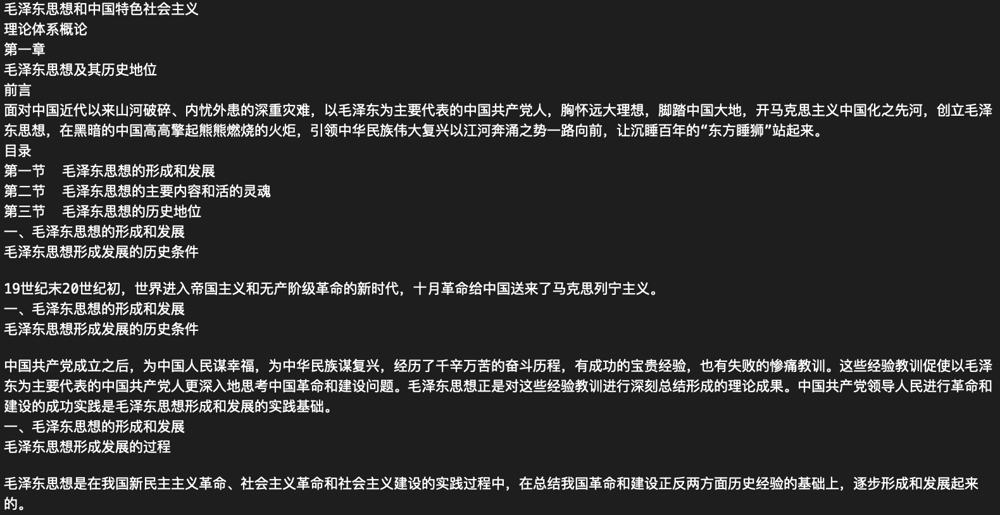

# ppt-to-txt
convert .pptx file to .txt file using python.

使用python读取.pptx文件中的文字，写入.txt中。

# Installation 

`pip install -r requirements.txt`

使用 python-pptx 和 glob（如果显示没有glob，请用pip安装glob）

注：适用于 .pptx类型，.ppt格式需要转换为.pptx格式。
# Usage

将想要转换的 .pptx 文件（支持多个文件同时执行）放入 clone 下来的文件夹中，打开终端，输入 `python ppt-to-txt.py`,即可得到txt文件

# Example

  
  
   
  Left: pptx file  ;  Right: txt file

# License
[MIT License](LICENSE)

